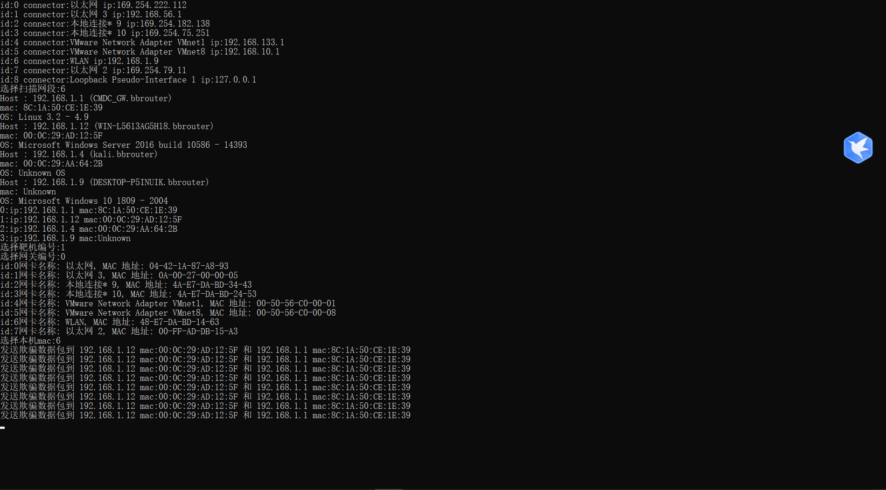
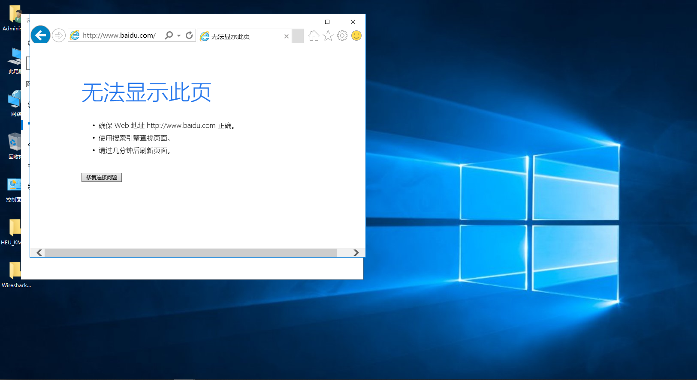

Nmap_ArpSpoofing

简介：自动扫描局域网内存活主机，实现arp攻击自动化


依赖安装：

安装nmap

```
https://nmap.org/
```

设置环境变量

```
右键点击“此电脑”或“我的电脑”，选择“属性”。
在弹出的窗口中，点击“高级系统设置”。
在“系统属性”窗口中，点击“环境变量”按钮。
在“环境变量”窗口中，找到“系统变量”部分，找到名为 Path 的变量，然后点击“编辑”。
在“编辑环境变量”窗口中，点击“新建”，然后输入 nmap 的安装路径（例如 C:\Program Files (x86)\Nmap）。
点击“确定”保存更改。
```

```
pip install python-nmap psutil scapy
```

演示：


